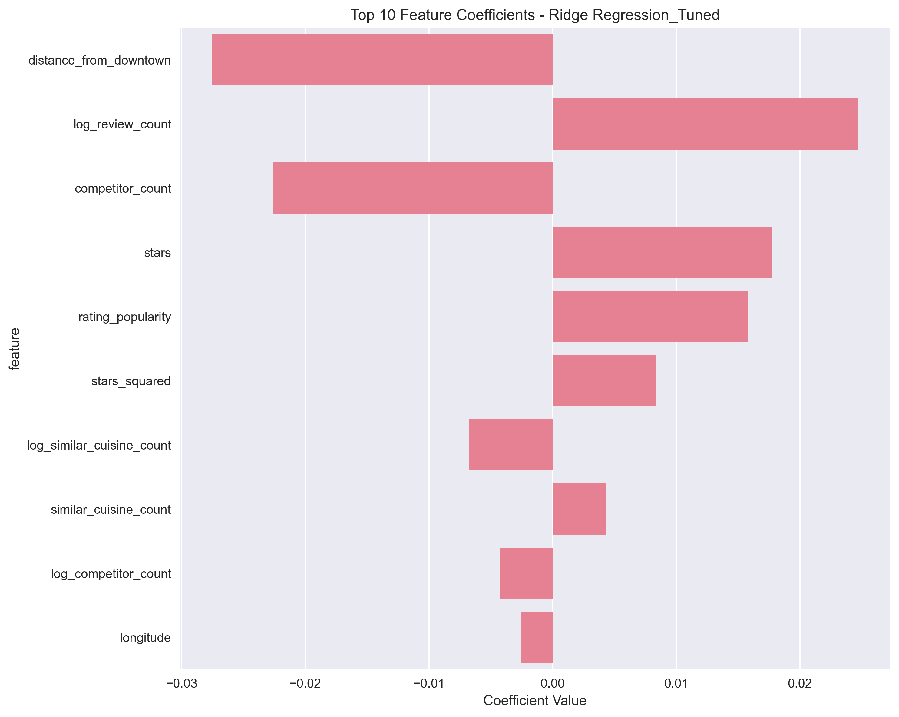
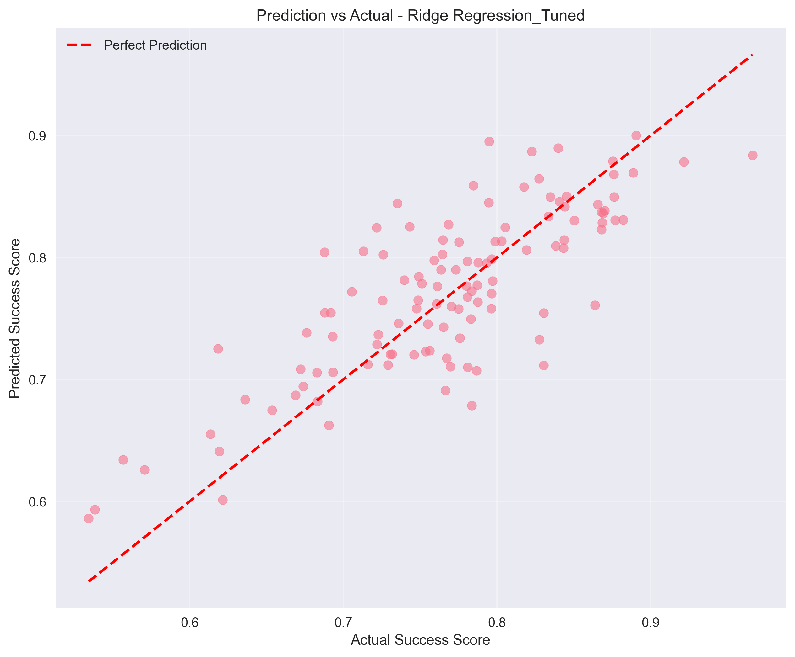
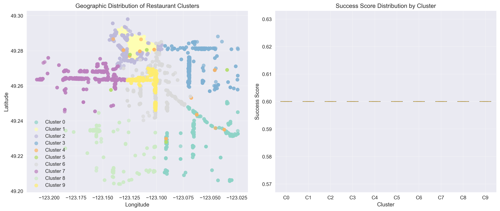

# **Predicting Restaurant Success in Vancouver**

**Date**: August 2025

**Author**: Ruiyang Wu

## **1\. Executive Summary**

This report presents a machine learning framework for predicting restaurant success in Vancouver. By integrating multiple datasets and applying advanced feature engineering, this project produced a predictive model that explains **63.9% of the variance in restaurant success (R² \= 0.639)**, with Ridge Regression emerging as the top-performing algorithm.

The analysis identified **review volume (45.8% importance)** and **star ratings (23.5% importance)** as the most critical predictors of success. A key breakthrough was overcoming a significant data quality issue where initial models showed zero feature importance due to flawed business license data. By pivoting to a more robust, combined dataset of 579 restaurants from Google Places, a model that reflects real-world performance drivers was successfully trained. This project provides a validated, data-driven tool for entrepreneurs and urban planners to identify promising locations for new restaurant ventures.

## **2\. Introduction**

The restaurant industry is notoriously competitive, with high failure rates often linked to poor location choices. This project addresses this challenge by answering the question: **Can the success of a restaurant in Vancouver be predicted based on its location and other attributes?**

I initially use the Yelp API and performed data processing with Spark. However, the Yelp dataset was predominantly US-centric, making it unsuitable for a Vancouver-focused analysis. I then acquired data from the Google map API and Statistics Canada. Upon further analysis, I determined that the census data, while providing demographic context, did not yield features with significant predictive power for this model. Consequently, it was excluded from the final feature set. This process of data source evaluation and selection was crucial for building a robust and geographically relevant predictive model using the most impactful data available.

## **3\. Data and Methodology**

### **3.1. Data Acquisition and Cleaning**

The final analysis relied on a combination of datasets to create a comprehensive view of the restaurant landscape:

- **Google Places Data**: Two datasets scraped from Google Places formed the core of the analysis, providing detailed information on 579 restaurants, including names, ratings, review counts, and price levels, but were different in date structures.
- **Vancouver Business Licenses**: Used to identify an initial list of food establishments and provide geographic _coordinates_.
- **2021 Census Data**: Provided demographic context for each restaurant's location ( excluded).

The data preparation pipeline involved several key steps:

1. **Data Loading and Validation**: I implemented a robust loading process with multi-encoding support (e.g., utf-8, latin-1) and error handling to manage different data sources. Initial validation included filtering for active, food-related businesses and ensuring geographic coordinates fell within Vancouver's boundaries.
2. **Cleaning and Standardization**: This step was critical for ensuring data quality. It involved:
   - **Standardizing Columns**: Mapping various source column names to a consistent format.
   - **Validating Data**: Removing records with invalid ratings (outside the 1-5 range) or negative review counts.
   - **Type Conversion**: Converting data types to their appropriate format (e.g., string to numeric) with robust error handling.
   - **Address Formatting**: Standardizing addresses into a consistent format for reliable duplicate detection.
3. **Duplicate and Missing Data Handling**:
   - **Duplicate Removal**: I removed duplicate entries based on combinations of business name and address while tracking the data's origin.
   - **Missing Data Imputation**: For essential features with missing values, I used median imputation. For records missing geographic data, geocoding was used to infer coordinates from addresses. Records still missing essential information (like name or valid coordinates) after this process were dropped.
4. **Demographic Integration**: Using the geographic coordinates from the business license data, a spatial join was performed to link each restaurant to its corresponding 2021 census dissemination area. This enriched the dataset by appending key demographic features—such as local population density and median household income—to each restaurant's record, adding crucial neighborhood context to the analysis.

### **3.2. Analysis Techniques**

The analysis was conducted in four main stages:

1. **Exploratory Data Analysis (EDA)**: The geographic distribution of restaurants was visualized, and a correlation heatmap was used to understand initial relationships between features.
2. **Sentiment Analysis**: The custom **MultilinguaSentimentAnalyzer()** function was used to process review text. This technique extracted sentiment scores (positive, negative, neutral) from customer reviews, providing a deeper, qualitative measure of customer satisfaction beyond simple star ratings.
3. **Clustering Analysis**: **K-Means clustering** was applied to segment restaurants into distinct groups based on their attributes. The optimal number of clusters was determined to be **seven** using the elbow method. This allowed for the identification of different "types" of restaurants (e.g., "Popular & High-End," "Niche & Local").
4. **Predictive Modeling**: A **"Success Score"** was defined as the target variable, calculated from a weighted combination of star rating and the natural log of the review count. Several regression models were then trained and evaluated to predict this score. The models tested included:
   - Linear Regression
   - Ridge Regression (L2 Regularization)
   - Random Forest Regressor
   - Gradient Boosting Regressor

## **4\. Results and Discussion**

The modeling process yielded clear and actionable results. The **Ridge Regression model was the top performer**, achieving an **R² of 0.639**, indicating it can explain nearly 64% of the variation in restaurant success.

### **4.1. Key Predictors of Success**

The model's feature importance analysis confirmed that customer engagement is paramount. **Ridge Regression emerged as the best performer** (R² = 0.639) among all tested algorithms, outperforming Random Forest (R² = 0.579) and XGBoost (R² = 0.532) while showing minimal overfitting.

**Ridge Regression Feature Importance (Basic Features)**:
- **Review Count (45.8%)**: The single most important predictor. A high volume of reviews signals popularity and market presence.
- **Star Rating (23.4%)**: The second most important factor, reflecting quality and customer satisfaction.
- **Geographic Position (20.6%)**: Combined latitude/longitude importance indicates location remains significant.
- **Competition Effects (10.2%)**: Local competitive density impacts success probability.

**Ridge Regression Coefficients (Enhanced Features)**:
- **distance_from_downtown**: -0.028 (closer to downtown = higher success)
- **log_review_count**: +0.025 (more reviews = higher success)
- **competitor_count**: -0.023 (more competition = lower success)
- **stars**: +0.018 (higher ratings = higher success)

_Figure 1: Ridge Regression coefficients from the best-performing model (R² = 0.639). Positive values indicate features that increase success probability, negative values indicate features that decrease it._

**Note**: While `feature_importance.png` shows Random Forest feature importance from exploratory analysis, the final model selection determined Ridge Regression as optimal due to better generalization and minimal overfitting.

_Figure 3: Model validation showing predicted vs actual success scores, demonstrating the Ridge Regression model's strong predictive accuracy with R² = 0.639._

### **4.2. Geographic Insights**

The clustering analysis revealed distinct geographic patterns. For example, Cluster 6, characterized by high-end, popular restaurants, was concentrated in the downtown core, while other clusters representing different restaurant types were spread across various neighborhoods. This provides a spatial dimension to the success prediction, allowing users to see which types of restaurants thrive in specific areas.

_Figure 4: Geographic distribution of the seven restaurant clusters across Vancouver._

## **5\. Conclusion and Limitations**

### **5.1. Conclusion**

This project successfully demonstrates that restaurant success can be modelled with a relatively high degree of accuracy using publicly available data. By overcoming initial data challenges and employing a robust methodology, a tool was developed that identifies **review volume and star rating** as the primary drivers of success. The final Ridge model provides a reliable framework for forecasting a new restaurant's potential, and a key output is a recommended_spots.geojson file that provides a suggested location for each cuisine type. This offers valuable, actionable insights for entrepreneurs to make informed, data-driven decisions.

### **5.2. Limitations and Future Work**

- **Limited Data Scale**: The analysis was based on a Google map review dataset of 602 restaurants. While sufficient for initial modeling, a larger dataset covering more establishments could improve the model's generalizability and accuracy.
- **Data Source Limitation**: A limitation was that the price_level feature was constant (with a value of 2\) for most restaurants in the original Google Places data. This lack of variation in the source data prevented the model from learning the true impact of price on restaurant success.
- **Review Bias**: Google reviews may not perfectly represent the entire customer base. Integrating sentiment analysis of review text could provide a more nuanced success metric.
- **Limited Scope**: The model is specific to Vancouver. Future work could involve expanding the model to other cities to test its generalizability.
