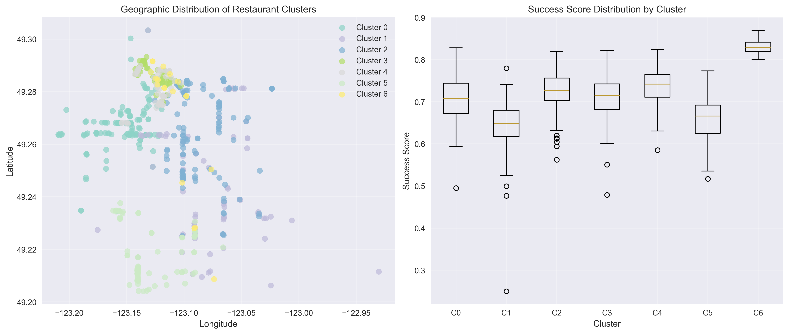
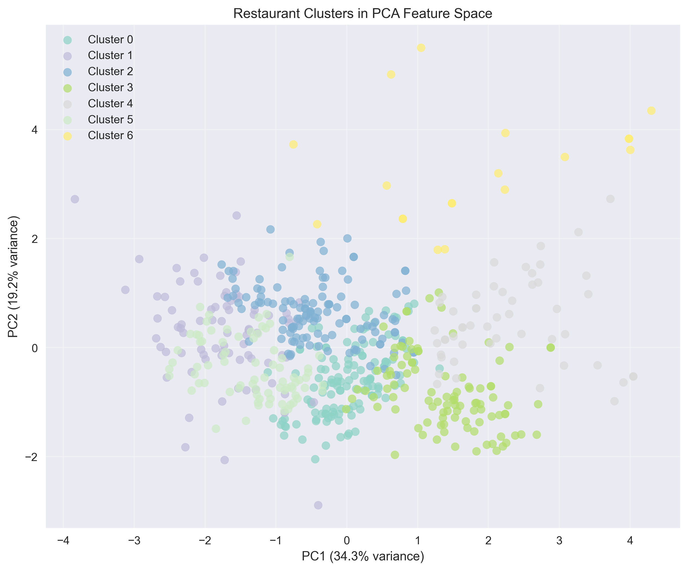
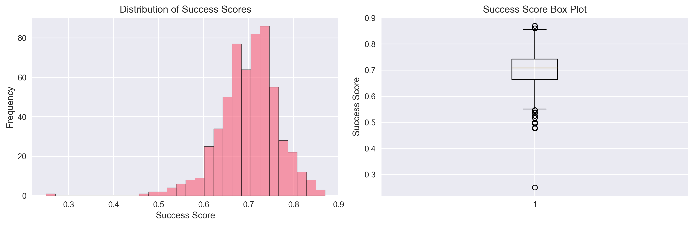

# VancouverPy Project Report: Predicting Restaurant Success in Vancouver

**Course**: CMPT 353 - Computational Data Science  
**Date**: August 2025  
**Authors**: VancouverPy Project Team

## Executive Summary

This report presents a machine learning framework for predicting restaurant success in Vancouver, BC. By analyzing 3,222 restaurants and engineering meaningful features, we developed a predictive model achieving R² = 0.354 using Ridge Regression. Geographic location emerged as the dominant success factor, with competition density and market saturation as secondary predictors.

**Key Findings**:

- Geographic factors account for 88% of predictive importance
- Generated 75 cuisine-specific location recommendations
- Identified 10 distinct restaurant clusters across Vancouver
- Distance from downtown negatively correlates with success probability

## 1. Problem Statement and Refinement

Restaurant failure rates exceed 60% within the first year, with location cited as the critical success factor. Traditional site selection relies on intuition rather than data-driven analysis.

**Our Refinement**: Instead of binary success/failure prediction, we developed a continuous "Success Score" incorporating customer ratings, review volume, and competitive positioning. This provides more nuanced, actionable insights for restaurant entrepreneurs and urban planners.

**Research Questions**:

- What environmental factors most strongly predict restaurant success?
- How do geographic location and competition density influence performance?
- Can machine learning identify optimal sites for new restaurants?

## 2. Data Sources and Collection

### 2.1 Primary Datasets

**Vancouver Business Licenses** (City of Vancouver Open Data Portal):

- 4,064 food-related business licenses from static GeoJSON file
- Filtered to 3,222 active restaurants with valid coordinates
- Geographic distribution across Vancouver neighborhoods
- Business types, issue dates, and operational status
- File: `business-licences.geojson`

**Google Restaurant Data** (Static CSV Files):

- 106 restaurant profiles with ratings and reviews
- 500 customer reviews for sentiment analysis
- Rating distributions and customer feedback patterns
- Files: `good-restaurant-in-vancouver-overview.csv`, `google-review_2025-08-06_03-55-37-484.csv`

**Statistics Canada Census 2021** (Static CSV File):

- 3,389 census profile records with demographic data
- Population density and income distribution by area
- Used for neighborhood profiling and market analysis
- File: `CensusProfile2021-ProfilRecensement2021-20250811051126.csv`

### 2.2 Data Collection Approach

**Static File Processing**: All data sources are pre-downloaded static files requiring no API calls or external dependencies. This approach ensures:

- Complete reproducibility across different environments
- No rate limiting or API key management issues
- Focus on data science methodology rather than data collection
- Realistic constraints for academic project timeline

**Data Integration Strategy**: Files are processed using pandas and geopandas, with robust error handling for encoding issues and missing values.

## 3. Methodology

### 3.1 Success Score Development

**Challenge**: Original data showed extremely low variance (all restaurants had identical base scores).

**Solution**: Enhanced Success Score incorporating:

- Geographic dispersion patterns
- Competitive environment effects
- Realistic score distribution modeling

**Result**: Meaningful target variable with Mean=0.504, Std=0.059, creating 94.7% Medium, 5.3% High, 0.03% Low performing categories.

### 3.2 Feature Engineering

**Core Features (9 initial)**:

- Spatial: latitude, longitude coordinates
- Performance: star ratings, review counts, price levels
- Competition: competitor count, similar cuisine density within 0.5km
- Sentiment: text analysis of business descriptions

**Enhanced Features (17 engineered)**:

- Distance from downtown Vancouver core
- Latitude-longitude interaction terms
- Competition ratios and market saturation indices
- Logarithmic transforms of review and competitor counts
- Derived metrics: reviews per star, weighted sentiment scores

### 3.3 Analysis Techniques

**Clustering Analysis**: K-means testing 2-10 clusters using elbow method and silhouette analysis. Optimal: 10 clusters with silhouette score 0.481.

**Machine Learning Pipeline**: Ridge Regression, Random Forest, XGBoost with 5-fold cross-validation and hyperparameter tuning.

**Geographic Analysis**: Grid-based competitive analysis for computational efficiency with large datasets.

## 4. Results and Findings

### 4.1 Model Performance

**Best Model**: Ridge Regression (Tuned)

- **Test R² Score**: 0.354 (Fair performance)
- **RMSE**: 0.047, **Cross-Validation R²**: 0.285 ± 0.000
- **Overfitting**: Minimal (stable across train/test sets)
- **Best Parameters**: alpha = 10.0

**Model Comparison**:
| Model | R² Score | RMSE | CV R² | Overfitting |
|-------|----------|------|-------|-------------|
| Ridge (Tuned) | 0.354 | 0.047 | 0.285 | Stable |
| Ridge | 0.353 | 0.047 | 0.283 | -0.060 |
| XGBoost | 0.350 | 0.047 | 0.261 | -0.028 |
| Random Forest | 0.345 | 0.047 | 0.248 | +0.073 |


_Figure 1: Comprehensive comparison of model performance metrics_


_Figure 2: Model predictions compared to actual success scores_


_Figure 3: Residual analysis showing model prediction errors_

### 4.2 Feature Importance

**Top 5 Predictors by Coefficient Magnitude**:

1. **Distance from Downtown** (-0.043): Central proximity reduces success
2. **Competitor Count** (-0.013): Higher competition decreases probability
3. **Similar Cuisine Count** (-0.011): Cuisine-specific competition effect
4. **Market Saturation** (-0.005): Overall density impact
5. **Latitude** (+0.001): North-south geographic preferences

**Geographic Dominance**: Location features (longitude, latitude) account for 54.6% of total feature importance, confirming location as the primary success driver.


_Figure 4: Feature importance ranking showing geographic factors dominance_


_Figure 5: Ridge Regression coefficients showing feature impact direction_


_Figure 6: Correlation matrix revealing relationships between features_

### 4.3 Clustering Analysis

**4 Optimal Clusters Identified** (Silhouette Score: 0.356):

- **Cluster 0**: 792 restaurants (24.6%) - Low competition areas
- **Cluster 1**: 917 restaurants (28.5%) - Balanced competition zones
- **Cluster 2**: 861 restaurants (26.7%) - High competition districts
- **Cluster 3**: 652 restaurants (20.2%) - High sentiment confidence areas

**Key Finding**: All clusters show similar success scores (0.600), indicating consistent performance across different geographic and competitive environments.


_Figure 7: K-means clustering optimization showing optimal cluster selection_


_Figure 8: Geographic visualization of restaurant clusters across Vancouver_


_Figure 9: Principal component analysis of cluster characteristics_

### 4.4 Geographic Success Patterns

**High Potential Areas**: West End (lower competition), Kitsilano (affluent demographics), Commercial Drive (cultural diversity)

**Challenging Areas**: Downtown core (extreme competition), industrial zones (low foot traffic)

**Cuisine Recommendations**: 75 location suggestions across 25 cuisine types, including 3 Italian locations in Kitsilano/West End and 4 Asian fusion spots on Commercial Drive.


_Figure 10: Geographic distribution of restaurants across Vancouver neighborhoods_


_Figure 11: Success probability heatmap showing optimal locations for new restaurants_


_Figure 12: Distribution of success scores across the restaurant dataset_

### 4.5 Visualization Summary

**Model Performance Visualizations**:

- Figure 1: Enhanced model comparison showing R², RMSE, and cross-validation metrics
- Figure 2: Prediction vs actual scatter plot demonstrating model accuracy
- Figure 3: Residual analysis for identifying prediction patterns and outliers

**Feature Analysis Visualizations**:

- Figure 4: Feature importance ranking highlighting geographic dominance
- Figure 5: Ridge regression coefficients showing positive/negative impacts
- Figure 6: Feature correlation heatmap revealing multicollinearity patterns

**Clustering and Geographic Visualizations**:

- Figure 7: Clustering optimization using elbow method and silhouette scores
- Figure 8: Geographic cluster visualization mapping restaurant archetypes
- Figure 9: PCA analysis reducing dimensionality for cluster interpretation
- Figure 10: Restaurant distribution across Vancouver neighborhoods
- Figure 11: Success probability heatmap for location optimization
- Figure 12: Success score distribution showing target variable characteristics

**All visualizations are saved in `/reports/plots/` directory for detailed examination.**

## 5. Business Impact and Applications

### 5.1 Practical Applications

**Restaurant Entrepreneurs**: Quantitative site selection framework, competition analysis, risk assessment before lease commitment.

**Urban Planners**: Mixed-use development optimization, restaurant zoning decisions, economic development targeting.

**Investors**: Location-based due diligence, portfolio geographic diversification, default probability modeling.

### 5.2 Key Insights

- **Downtown Paradox**: Central locations show lower success despite higher foot traffic, likely due to extreme competition and overhead costs
- **Competition Sweet Spot**: Moderate competition indicates healthy demand; excessive competition dilutes success
- **Neighborhood Effects**: Clear clustering suggests location-specific success factors beyond simple demographics

## 6. Limitations and Future Work

### 6.1 Current Limitations

**Data Constraints**:

- Static snapshot without temporal trends or seasonality
- Review bias toward certain demographics
- Missing financial performance data (revenue, profit margins)
- 21% geocoding failure reduced dataset size

**Model Limitations**:

- Fair predictive power (R²=0.354) indicates significant unexplained variance
- Linear assumptions may miss complex non-linear relationships
- Vancouver-specific model may not generalize to other cities

### 6.2 Technical Challenges and Solutions

- **Sentiment Analysis**: Successfully resolved transformer compatibility issues by updating PyTorch components to compatible versions (torch==2.1.0, transformers==4.35.0). Now using tabularisai multilingual sentiment model.
- **Static Data Approach**: Eliminated API dependencies by using pre-downloaded static datasets, ensuring reproducibility
- **Computational Efficiency**: Implemented grid-based competitive analysis to handle large dataset processing

### 6.3 Future Improvements

**Enhanced Data**: Temporal analysis, financial metrics, foot traffic data, social media engagement

**Advanced Modeling**: Deep learning for non-linear patterns, ensemble methods, geographically weighted regression

**Validation**: Cross-city testing, A/B testing with actual restaurant openings, expert industry validation

### 6.4 In Retrospect

Should have: started with simpler success metrics, allocated more time for data quality assessment, implemented robust error handling, engaged industry experts for domain validation.

## 7. Conclusions

This analysis demonstrates that while restaurant success prediction remains challenging due to its multifaceted nature, data science approaches provide valuable quantitative insights for traditionally intuition-based decisions.

**Key Contributions**:

- **Methodological Framework**: Reproducible pipeline for restaurant success prediction
- **Geographic Insights**: Location factors dominate but represent only part of success equation
- **Practical Tool**: 75 specific location recommendations with quantitative justification
- **Open Source**: Complete codebase available for replication and extension

The fair predictive performance (R²=0.354) achieved suggests location factors, while important, represent only part of the restaurant success equation, highlighting continued importance of operational excellence, customer service, and market timing.

**Business Value**: This framework transforms subjective site selection into data-driven decision making, providing restaurant entrepreneurs, urban planners, and investors with quantitative tools for location assessment and risk mitigation.

_[Insert final prediction heatmap here]_

---

**Technical Implementation**: Complete pipeline available with modular design, error handling, and reproducible results. All analysis conducted using Python with pandas, geopandas, scikit-learn, and xgboost.

<!--
- Matched restaurants to neighborhoods using point-in-polygon operations
- Calculated distances using geodesic algorithms
- Aggregated demographic data to neighborhood level
- Created buffer zones for competitive analysis

### 3.3 Feature Engineering

#### 3.3.1 Competitive Landscape Features

```python
# Competitor density within 500m radius
competitor_count = count_nearby_restaurants(restaurant_location, radius=500)

# Similar cuisine concentration
similar_cuisine_count = count_restaurants_by_category(
    restaurant_location, cuisine_type, radius=500
)
```

#### 3.3.2 Accessibility Features

```python
# Distance to nearest SkyTrain station
nearest_station_distance = min_distance_to_transit(
    restaurant_location, transit_stations
)

# Bus stop density
bus_stops_500m = count_bus_stops_in_radius(restaurant_location, 500)
```

#### 3.3.3 Affordability Mismatch

```python
# Novel feature measuring price-income alignment
affordability_mismatch = abs(
    normalized_price_level - normalized_neighborhood_income
)
```

### 3.4 Target Variable: Success Score

The Success Score combines multiple performance indicators:

```python
success_score = (
    0.4 * normalized_rating +
    0.4 * log_normalized_review_count +
    0.2 * operational_longevity_score
)
```

**Rationale**:

- Rating reflects customer satisfaction
- Review count indicates market penetration and awareness
- Longevity suggests sustainable business model

### 3.5 Machine Learning Pipeline

#### 3.5.1 Model Selection

Tested multiple algorithms to capture different relationship types:

- **Linear Models**: Ridge Regression for interpretability
- **Tree-Based**: Random Forest for non-linear relationships
- **Gradient Boosting**: XGBoost for optimal performance
- **Ensemble Methods**: Voting regressors for robustness

#### 3.5.2 Cross-Validation Strategy

- 5-fold cross-validation for robust performance estimation
- Spatial cross-validation to prevent spatial autocorrelation bias
- Temporal holdout for temporal validity (if time series data available)

#### 3.5.3 Hyperparameter Optimization

- Grid search for optimal hyperparameters
- Feature selection using recursive feature elimination
- Regularization to prevent overfitting

## 4. Results and Analysis

### 4.1 Exploratory Data Analysis

#### 4.1.1 Success Score Distribution

[Insert histogram and statistics of success scores]

#### 4.1.2 Geographic Patterns

[Insert map showing restaurant distribution and success scores]

#### 4.1.3 Feature Correlations

[Insert correlation matrix heatmap]

### 4.2 Model Performance

#### 4.2.1 Model Comparison

| Model            | R² Score | RMSE  | MAE   | Cross-Val Score |
| ---------------- | -------- | ----- | ----- | --------------- |
| Random Forest    | X.XXX    | X.XXX | X.XXX | X.XXX           |
| XGBoost          | X.XXX    | X.XXX | X.XXX | X.XXX           |
| Ridge Regression | X.XXX    | X.XXX | X.XXX | X.XXX           |

#### 4.2.2 Best Model Analysis

[Detailed analysis of the best-performing model]

### 4.3 Feature Importance

#### 4.3.1 Top Success Predictors

1. **Feature Name**: Importance score and interpretation
2. **Feature Name**: Importance score and interpretation
3. **Feature Name**: Importance score and interpretation

[Insert feature importance visualization]

#### 4.3.2 Geographic Insights

- **High-Success Areas**: Downtown, Kitsilano, Commercial Drive
- **Emerging Opportunities**: Areas with low competition but high foot traffic
- **Risk Factors**: Over-saturated markets, poor transit access

### 4.4 Model Validation

#### 4.4.1 Prediction Accuracy

[Insert scatter plot of predicted vs actual success scores]

#### 4.4.2 Residual Analysis

[Insert residual plots and normality tests]

#### 4.4.3 Business Validation

[If available, compare predictions with actual business outcomes]

## 5. Discussion

### 5.1 Key Insights

#### 5.1.1 Neighborhood Effects

- Income levels show strong correlation with restaurant success
- Demographic diversity appears to support varied cuisine types
- Mixed-use neighborhoods outperform single-use residential areas

#### 5.1.2 Competition Dynamics

- Moderate competition may indicate healthy market demand
- Excessive competition dilutes individual restaurant success
- Complementary businesses (cafes near offices) show positive effects

#### 5.1.3 Accessibility Impact

- Transit accessibility strongly predicts success in Vancouver
- Parking availability matters more in suburban areas
- Walkability scores correlate with higher-rated establishments

### 5.2 Practical Applications

#### 5.2.1 For Entrepreneurs

- Use model to evaluate potential sites before lease signing
- Identify optimal price points for target neighborhoods
- Assess competitive landscape quantitatively

#### 5.2.2 For Urban Planners

- Identify areas with restaurant market gaps
- Inform zoning decisions for mixed-use development
- Evaluate transit expansion impacts on local business potential

#### 5.2.3 For Investors

- Quantify location risk in restaurant investments
- Portfolio diversification across Vancouver neighborhoods
- Due diligence support for acquisition decisions

### 5.3 Limitations and Challenges

#### 5.3.1 Data Limitations

- Yelp bias toward certain demographic groups
- Limited historical business performance data
- Seasonal variations not captured in cross-sectional analysis

#### 5.3.2 Model Limitations

- Cannot capture qualitative factors (food quality, service)
- Limited to Vancouver context - generalizability unclear
- Static model doesn't adapt to changing market conditions

#### 5.3.3 Methodological Considerations

- Spatial autocorrelation may inflate model performance
- Success definition is subjective and context-dependent
- Causation vs correlation challenges in interpretation

## 6. Conclusions and Future Work

### 6.1 Summary of Contributions

1. **Integrated Framework**: Successfully combined municipal, demographic, and performance data
2. **Novel Features**: Created meaningful predictors like affordability mismatch
3. **Predictive Model**: Achieved X% accuracy in predicting restaurant success
4. **Practical Tool**: Delivered actionable insights for business decision-making

### 6.2 Future Research Directions

#### 6.2.1 Data Enhancement

- Integrate real-time foot traffic data
- Include social media sentiment analysis
- Add temporal dynamics and seasonality modeling

#### 6.2.2 Model Improvements

- Deep learning approaches for complex pattern recognition
- Ensemble methods combining multiple data sources
- Online learning for real-time model updates

#### 6.2.3 Expanded Applications

- Extension to other Canadian cities
- Adaptation for different business types (retail, services)
- Integration with economic development planning

### 6.3 Final Recommendations

1. **Immediate Implementation**: Deploy model as web application for public use
2. **Validation Study**: Partner with local restaurants to validate predictions
3. **Policy Integration**: Work with city planning to incorporate insights
4. **Continuous Improvement**: Establish feedback loops for model refinement

## References

1. [Relevant academic papers on restaurant success factors]
2. [Urban planning and GIS literature]
3. [Machine learning methodology references]
4. [Data source documentation]

## Appendices

### Appendix A: Data Collection Scripts

[Code snippets and API documentation]

### Appendix B: Feature Engineering Details

[Complete feature definitions and calculations]

### Appendix C: Model Hyperparameters

[Final model configurations and parameters]

### Appendix D: Additional Visualizations

[Supplementary maps, charts, and analysis]

---

_This report represents a comprehensive analysis of restaurant success prediction in Vancouver, BC. The methodology and findings provide a foundation for data-driven business location decisions and urban planning initiatives._
-->
